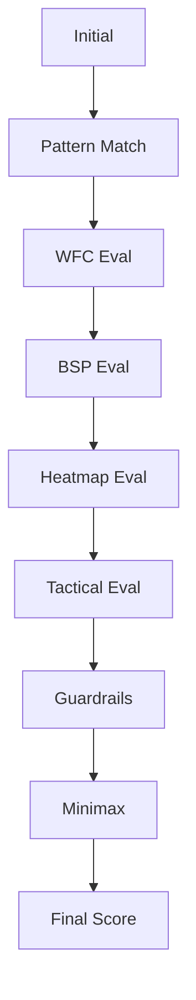

# Enhanced Chess AI - Move Evaluation and Visualization System

## Overview

This document describes the comprehensive enhancements made to the chess AI system, focusing on move evaluation, visualization, and the integration of multiple AI engines (WFC, BSP, Heatmaps, Tactical Analysis).

## Table of Contents

1. [Core Components](#core-components)
2. [Move Evaluation Pipeline](#move-evaluation-pipeline)
3. [Visualization Features](#visualization-features)
4. [Configuration](#configuration)
5. [Bot Integration](#bot-integration)
6. [Usage Examples](#usage-examples)

---

## Core Components

### 1. MoveObject (`core/move_object.py`)

The `MoveObject` class is the centerpiece of the enhanced system. It tracks a move candidate through the entire evaluation pipeline, recording:

- **Evaluation Stages**: From initial pattern matching through final score calculation
- **Method Results**: Output from each evaluation method (WFC, BSP, Heatmap, Tactical, Guardrails, Minimax)
- **Status Tracking**: PENDING, PROCESSING, COMPLETED, SKIPPED, FAILED for each method
- **Visualization Data**: Heatmap intensities, BSP zones, tactical squares, guardrails status
- **Metadata**: Processing times, active methods, confidence scores

**Key Features:**
- Tracks which methods are "active" (DA/YES) for the current board position
- Stores values and metadata from each evaluation method
- Provides visualization data for the UI
- Calculates weighted final scores

**Example:**
```python
from core.move_object import create_move_object, MoveStage, MethodStatus

# Create move object
move_obj = create_move_object(move, board, bot_name="HybridBot")

# Update stage
move_obj.update_stage(MoveStage.WFC_EVAL)

# Add method result
move_obj.add_method_result(
    "WFCEngine",
    MethodStatus.COMPLETED,
    value=0.85,
    active=True,
    patterns_matched=3
)

# Calculate final score
final_score = move_obj.calculate_final_score()
```

### 2. Timing Configuration (`utils/timing_config.py`)

Centralized configuration system for all timing parameters:

**Timing Settings:**
- `move_time_ms`: Main move calculation time (default: 700ms)
- `min_move_delay_ms`: Minimum delay between moves (default: 400ms)
- `visualization_delay_ms`: Delay for visualization updates (default: 50ms)
- `cell_animation_delay_ms`: Delay for green cell animation (default: 50ms)
- `heatmap_update_delay_ms`: Delay for heatmap updates (default: 100ms)

**Configuration File:**
Located at `configs/move_timing.json` - easily editable JSON format.

**Usage:**
```python
from utils.timing_config import get_timing_config

config = get_timing_config()
move_time = config.move_time_ms  # 700
config.move_time_ms = 1000  # Change to 1 second
config.save_config()
```

### 3. WFC Engine (`chess_ai/wfc_engine.py`)

Wave Function Collapse engine for pattern-based move generation.

**Enhanced Features:**
- **COW Opening Patterns**: Central Opening Wing system (90% frequency)
  - e4 + d4 pawn center
  - Kingside knight development (Nf3)
  - Queenside knight development (Nc3)
  - Kingside bishop fianchetto
  - Early castling preparation
- Traditional openings (reduced to 50% frequency)
- Tactical patterns (forks, pins)
- Constraint-based pattern matching

**COW Opening System:**
COW (Central Opening Wing) is a flexible opening system focusing on:
1. Strong central pawn presence (e4 + d4)
2. Rapid wing development
3. Early king safety
4. Flexible piece placement

### 4. BSP Engine (`chess_ai/bsp_engine.py`)

Binary Space Partitioning engine for zone control analysis.

**Features:**
- Recursive board partitioning into strategic zones
- Zone classification: center, flank, edge, corner, general
- Zone importance weights for evaluation
- Adjacent zone analysis
- Zone control calculation by color
- Visualization with `visualize_zones()` method

**Zone Importance:**
- Center: 2.0x multiplier
- Flank: 1.5x multiplier
- Edge: 1.0x multiplier
- Corner: 0.5x multiplier
- General: 1.0x multiplier

### 5. Guardrails (`chess_ai/guardrails.py`)

Safety checks for move validation:

**Checks:**
- Legality and sanity verification
- High-value piece hang detection (threshold: 500cp for rooks and above)
- Shallow blunder detection (2-ply depth)

**Usage:**
```python
from chess_ai.guardrails import Guardrails

guardrails = Guardrails(blunder_depth=2, high_value_threshold=500)

if guardrails.allow_move(board, move):
    # Safe to make this move
    pass
```

### 6. Hybrid Bot (`chess_ai/hybrid_bot.py`)

Comprehensive bot integrating all evaluation methods.

**Evaluation Pipeline:**
1. **Pattern Matching**: WFC pattern recognition
2. **WFC Evaluation**: Pattern-based scoring
3. **BSP Evaluation**: Zone control analysis
4. **Heatmap Evaluation**: Piece positioning scoring
5. **Tactical Evaluation**: Tactical motif detection (checks, captures, forks, pins)
6. **Guardrails**: Safety verification
7. **Minimax**: Depth search (simplified, extensible)
8. **Final Score**: Weighted combination

**Bot Name Display:**
Shows which engine was most influential: `HybridBot > WFC`, `HybridBot > BSP`, etc.

---

## Move Evaluation Pipeline

### Pipeline Stages



### Stage Details

#### 1. INITIAL
- Move object created
- Board state captured

#### 2. PATTERN_MATCH
- COW opening pattern matching
- Traditional opening patterns
- Tactical pattern recognition

#### 3. WFC_EVAL
- Wave Function Collapse pattern generation
- Constraint satisfaction checking
- Pattern frequency weighting

#### 4. BSP_EVAL
- Zone partitioning
- Zone type determination
- Control value calculation

#### 5. HEATMAP_EVAL
- Piece heatmap loading
- Intensity calculation for target square
- Piece-specific evaluation

#### 6. TACTICAL_EVAL
- Check detection
- Capture analysis
- Fork/pin/skewer detection
- Threat evaluation

#### 7. GUARDRAILS
- Legality verification
- Hang detection
- Blunder checking

#### 8. MINIMAX
- Depth search
- Material evaluation
- Threshold checking (>10%)

#### 9. FINAL
- Weighted score calculation
- Reason generation
- Confidence assessment

---

## Visualization Features

### 1. Mini Board Widget (`ui/mini_board_widget.py`)

A comprehensive visualization widget displayed in the Heatmap tab.

**Features:**

#### Red Gradient - Heatmap Overlay
- Shows piece heatmap intensities
- Intensity: 0.0 (no intensity) to 1.0 (maximum)
- Alpha: 0-150 for visibility
- Updates based on moving piece

#### Blue Gradient - BSP Zones
- Shows zone control values
- Lighter than heatmap for layering
- Alpha: 0-100
- Different zones visible simultaneously

#### Purple Gradient - Tactical Squares
- Highlights moves with minimax value > 10%
- Indicates high-value tactical opportunities
- Alpha: 0-120 based on value magnitude

#### Green Cell - Current Evaluation
- Animated pulsing effect
- Highlights square currently being evaluated
- Pulse rate: 50ms (configurable)
- Alpha oscillates: 0.3 to 1.0

**Info Panel:**
Displays:
- Current move (UCI notation)
- Evaluation stage
- Final score
- Active heatmap piece
- BSP zone type
- Tactical motifs

**Guardrails Statistics:**
Shows:
- Pass/fail status (✅/⚠️)
- Warning list
- Active method count

### 2. Method Status Widget (`ui/method_status_widget.py`)

Displays detailed status for all evaluation methods.

**Features:**

#### Status Icons
- ⏳ PENDING: Method queued for execution
- ⚙️ PROCESSING: Method currently running
- ✅ COMPLETED: Method finished successfully
- ⏭️ SKIPPED: Method not applicable
- ❌ FAILED: Method encountered error

#### For Each Method:
- Method name
- Current status
- Computed value
- Processing time (ms)
- Active indicator (🟢 ACTIVE)
- Metadata (constraints, patterns, etc.)

#### Summary Bar:
- Current move
- Evaluation stage
- Total methods
- Active method count
- Status breakdown
- Total processing time

#### Filter:
- Toggle "Show Only Active" to see only methods that apply to current position

### 3. Updated Usage Tab

**Additions:**
- Method Status Widget
- Real-time pipeline visualization
- Per-method timing information

### 4. Updated Heatmap Tab

**Additions:**
- Mini Board Widget
- Multi-layer gradient overlays
- Animated current evaluation
- Guardrails statistics

---

## Configuration

### Move Timing Configuration

**File:** `configs/move_timing.json`

```json
{
  "timing": {
    "move_time_ms": 700,
    "min_move_delay_ms": 400,
    "visualization_delay_ms": 50,
    "cell_animation_delay_ms": 50,
    "heatmap_update_delay_ms": 100
  },
  "auto_play": {
    "games_count": 10,
    "game_delay_ms": 2000,
    "move_delay_ms": 1000
  },
  "visualization": {
    "show_intermediate_steps": true,
    "highlight_current_cell": true,
    "animate_transitions": true,
    "show_method_status": true
  },
  "thresholds": {
    "minimax_value_threshold_percent": 10,
    "display_move_threshold": 0.1,
    "guardrails_penalty_factor": 0.5
  }
}
```

**Editing:**
1. Open `configs/move_timing.json`
2. Modify values as needed
3. Save file
4. Reload configuration in viewer (click Refresh or restart)

---

## Bot Integration

### Using HybridBot

**In code:**
```python
from chess_ai.hybrid_bot import HybridBot

# Create bot
bot = HybridBot(chess.WHITE)

# Choose move
move = bot.choose_move(board)

# Get details
reason = bot.get_last_reason()
features = bot.get_last_features()

# Bot name shows primary engine
print(bot.current_bot_name)  # e.g., "HybridBot > WFC"
```

### In PySide Viewer

Modify `WHITE_AGENT` or `BLACK_AGENT` in `pyside_viewer.py`:

```python
WHITE_AGENT = "HybridBot"
BLACK_AGENT = "DynamicBot"
```

The viewer will automatically:
- Create MoveObject instances
- Track evaluation pipeline
- Update visualizations
- Display method status

---

## Usage Examples

### Example 1: Running the Viewer with HybridBot

```bash
python pyside_viewer.py
```

The viewer now shows:
1. **Main board**: Standard chess board with pieces
2. **Heatmap tab**:
   - Mini board with all gradient overlays
   - Real-time evaluation highlighting
   - Guardrails statistics
3. **Usage tab**:
   - Method status pipeline
   - Active method indicators
   - Processing times

### Example 2: Adjusting Move Time

Edit `configs/move_timing.json`:
```json
{
  "timing": {
    "move_time_ms": 1000
  }
}
```

Or in code:
```python
from utils.timing_config import get_timing_config

config = get_timing_config()
config.move_time_ms = 1000
config.save_config()
```

### Example 3: Analyzing a Move

```python
from core.move_object import create_move_object, MoveStage, MethodStatus
from chess_ai.hybrid_bot import HybridBot
import chess

board = chess.Board()
bot = HybridBot(chess.WHITE)

# Choose move (automatically creates MoveObject)
move = bot.choose_move(board)

# Get the move object with full evaluation data
move_obj = bot.last_move_obj

# Inspect stages
print(f"Move: {move_obj.move.uci()}")
print(f"Final Score: {move_obj.final_score:.2f}")
print(f"Reason: {move_obj.reason}")

# Check active methods
for method in move_obj.get_active_methods():
    print(f"  {method.method_name}: {method.value:.3f}")

# Visualization data
viz_data = move_obj.get_visualization_data()
print(viz_data)
```

### Example 4: Custom Pattern Addition

```python
from chess_ai.wfc_engine import WFCEngine, ChessPattern, PatternType
import chess

engine = WFCEngine()

# Add custom pattern
custom_pattern = ChessPattern(
    pattern_type=PatternType.OPENING,
    squares=(chess.C2, chess.C4, chess.D2, chess.D4),
    pieces=(
        chess.Piece(chess.PAWN, chess.WHITE),
        chess.Piece(chess.PAWN, chess.WHITE),
        chess.Piece(chess.PAWN, chess.WHITE),
        chess.Piece(chess.PAWN, chess.WHITE)
    ),
    constraints=(("center_control", True), ("custom_opening", True)),
    frequency=0.75
)

engine.add_pattern(custom_pattern)
engine.learn_constraints_from_patterns()
```

### Example 5: BSP Zone Analysis

```python
from chess_ai.bsp_engine import create_chess_bsp_engine
import chess

engine = create_chess_bsp_engine()
board = chess.Board()

# Analyze zones
zone_stats = engine.analyze_board(board)
for zone_type, stats in zone_stats.items():
    print(f"{zone_type}: {stats['zones']} zones, {stats['total_pieces']} pieces")

# Visualize
print(engine.visualize_zones())

# Zone control by color
white_control = engine.calculate_zone_control(board, chess.WHITE)
print(f"White control: {white_control}")
```

---

## Key Improvements Summary

### 1. Move Object System ✅
- Complete move lifecycle tracking
- Method result storage
- Visualization data integration
- Status tracking (PENDING/PROCESSING/COMPLETED/SKIPPED/FAILED)

### 2. Timing Configuration ✅
- Centralized JSON configuration
- Easy adjustment of all timing parameters
- Runtime modification support
- 700ms move time now easily configurable

### 3. COW Opening Patterns ✅
- 90% frequency for COW opening
- Comprehensive pattern set
- Center + wing development focus
- Traditional openings reduced to 50%

### 4. WFC & BSP Integration ✅
- Full engine integration
- Bot name display shows active engine
- Pattern matching and zone analysis
- Constraint satisfaction

### 5. Mini Board Visualization ✅
- Multi-layer gradient system:
  - 🔴 Red: Heatmap intensities
  - 🔵 Blue: BSP zones
  - 🟣 Purple: Tactical squares (>10%)
  - 🟢 Green: Current evaluation (animated)
- Real-time piece display
- Info panel with move details
- Legend for gradient interpretation

### 6. Method Status Display ✅
- Complete pipeline visualization
- Active method indicators (DA/YES)
- Value and metadata display
- Processing time tracking
- Filter for active-only methods

### 7. Guardrails Statistics ✅
- Pass/fail indicators
- Warning list display
- Active method counter
- Integration with mini board

### 8. Animated Green Cell ✅
- 50ms pulse rate (configurable)
- Alpha oscillation (0.3-1.0)
- Highlights current evaluation square
- Smooth animation

---

## Architecture Diagram

```
┌─────────────────────────────────────────────────────────┐
│                    PySide Viewer                        │
│  ┌─────────────┬──────────────┬───────────────────┐    │
│  │  Main Board │  Heatmap Tab │    Usage Tab      │    │
│  │             │              │                    │    │
│  │  - Pieces   │  - Mini Board│  - Method Status  │    │
│  │  - Moves    │  - Overlays  │  - Timeline       │    │
│  │             │  - Stats     │  - Charts         │    │
│  └─────────────┴──────────────┴───────────────────┘    │
└─────────────────────────────────────────────────────────┘
                         │
                         ▼
┌─────────────────────────────────────────────────────────┐
│                    HybridBot                             │
│  ┌──────────────────────────────────────────────────┐   │
│  │         Move Evaluation Pipeline                 │   │
│  │  Pattern → WFC → BSP → Heatmap → Tactical       │   │
│  │         → Guardrails → Minimax → Final          │   │
│  └──────────────────────────────────────────────────┘   │
│                         │                                │
│     ┌──────────────────┼──────────────────┐             │
│     ▼                   ▼                  ▼             │
│  ┌──────┐          ┌──────┐          ┌──────┐          │
│  │ WFC  │          │ BSP  │          │Guard-│          │
│  │Engine│          │Engine│          │rails │          │
│  └──────┘          └──────┘          └──────┘          │
└─────────────────────────────────────────────────────────┘
                         │
                         ▼
┌─────────────────────────────────────────────────────────┐
│                   MoveObject                             │
│  - Tracks all evaluations                               │
│  - Stores method results                                │
│  - Provides visualization data                          │
│  - Calculates final scores                              │
└─────────────────────────────────────────────────────────┘
```

---

## Future Enhancements

### Potential Additions:
1. **Full Minimax/Alpha-Beta**: Replace simplified minimax with full depth search
2. **Neural Network Integration**: Add neural evaluation as a pipeline stage
3. **Pattern Learning**: Learn patterns from played games
4. **Advanced Tactical Detection**: Expand tactical motif recognition
5. **Time Management**: Dynamic time allocation based on position complexity
6. **Opening Book Integration**: Connect to standard opening databases
7. **Endgame Tablebases**: Add tablebase lookup for endgames
8. **Multi-PV Analysis**: Show multiple principal variations
9. **Real-time Heatmap Generation**: Generate heatmaps during evaluation
10. **Interactive Pattern Editor**: GUI for creating custom patterns

---

## Troubleshooting

### Issue: Visualizations not updating
**Solution**: Check that `show_method_status` is enabled in config and widgets are properly initialized.

### Issue: Green cell not animating
**Solution**: Ensure `animate_transitions` is `true` in config and `cell_animation_delay_ms` is reasonable (50-100ms).

### Issue: Move time not respected
**Solution**: Verify `move_time_ms` in `configs/move_timing.json` and that config is loaded with `get_timing_config()`.

### Issue: COW opening not showing 90% frequency
**Solution**: Check that `wfc_engine.add_opening_patterns()` has been called and patterns are properly initialized.

---

## Credits

**Enhancements developed by:** AI Assistant (Claude Sonnet 4.5)
**Based on:** Existing chess AI codebase
**Date:** 2025-10-24

---

## License

This enhanced system follows the same license as the original chess AI project.
